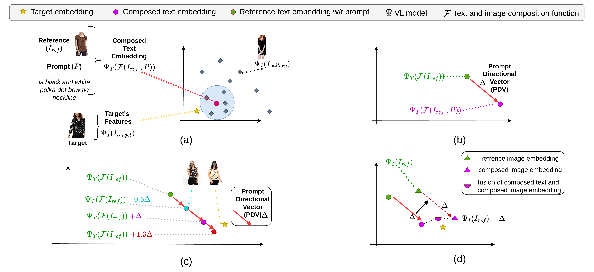

# PDV: Prompt Directional Vectors for Zero-shot Composed Image Retrieval

## Overview

PDV introduces **Prompt Directional Vectors** for zero-shot composed image retrieval (ZS-CIR). The core idea is to compute a directional vector in the embedding space that captures the semantic change described by a text prompt, and apply it to compose query representations without any task-specific training.

Given a reference image and a text prompt describing desired modifications, PDV:

1. Computes a **Prompt Directional Vector** as the difference between text embeddings with and without the prompt
2. Applies the directional vector at adjustable scales to steer retrieval in the embedding space
3. Fuses composed text and composed image embeddings for improved retrieval

  

## Code Release

The code will be released upon publication of the paper. Stay tuned!

## Questions

If you have any questions, please feel free to [open an issue](../../issues).
